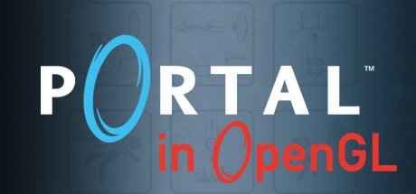

<p align="center">

   
   
   

</p>

<hr>

# Portal Recreation  

This is a recreation of the game Portal, a game developed by Valve. The game involves using a portal gun to create portals between two surfaces, allowing the player to traverse the environment and solve puzzles.

## Gameplay and Screenshots  
<details><summary><h3 align="left">🎮 Gameplay</summary>

https://github.com/FahdSeddik/PortalGL/assets/62207434/021f502b-ad35-4d57-9e31-c6afa539c0d3

</details>


<details><summary><h3 align="left">📷 Screenshots</summary>
<table> 
<tr><td>  </td><td>  </td></tr>
<tr><td>  </td><td>  </td></tr>
<tr><td>  </td><td>  </td></tr>
<tr><td>  </td><td>  </td></tr>
</table> 
</details>  

## Contents  

- [Portal Recreation](#portal-recreation)
  - [Gameplay & Screenshots](#gameplay-and-screenshots)
  - [Contents](#contents)
  - [Installation](#installation)
  - [How to Run](#how-to-run)
  - [Controls](#controls)
  - [To Do](#to-do)

## Installation  

To install the game, you need to clone this repository to your local machine. You can use the following command in your terminal:
```
git clone https://github.com/FahdSeddik/PortalGL.git
```

## How to Run  

To run the game, you need to compile the source code using [CMake](https://cmake.org/download/) and the provided `CMakeLists.txt` file.  
```
mkdir build
cmake -B build -S .
cmake --build build
```
An alternative for running the above commands, is to do the following after installing [CMake](https://cmake.org/download/).  
> 1. Download CMake Extension for VSCode
> 2. Click Build
> 3. Launch using `./bin/GAME_APPLICATION.exe` (make sure CWD is root folder)

## Controls  
 
  
| Movement | Sprint & Jump | Shooting | Interaction | 
| :------: | :------: | :------: | :------: |
|  <br>   |   |  |  |


## To Do  

- [ ] Integrate OpenAL for audio
- [ ] Handle Object intersecting portals
- [ ] Implement level loading
- [ ] Player Character Rendering
- [ ] Change Start Menu Screen

